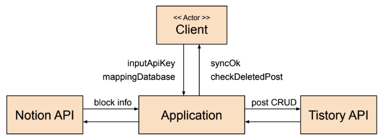

# Sync Notion Tistory

<!-- TOC -->

* [Sync Notion Tistory](#sync-notion-tistory)
    * [Business purpose](#business-purpose)
    * [System context diagram](#system-context-diagram)
    * [Use case list](#use-case-list)
        * [API Key 입력](#api-key-입력)
        * [관리 페이지 입력](#관리-페이지-입력)
        * [데이터베이스 매핑](#데이터베이스-매핑)
        * [동기화 대상 확인](#동기화-대상-확인)
        * [동기화 처리](#동기화-처리)
        * [HTML 파일 내보내기](#html-파일-내보내기)
    * [Concept of operation](#concept-of-operation)
        * [API 키 불러오기](#api-키-불러오기)
        * [Tistory 블로그 정보 불러오기](#tistory-블로그-정보-불러오기)
        * [Tistory 카테고리 불러오기](#tistory-카테고리-불러오기)
        * [데이터베이스 불러오기](#데이터베이스-불러오기)
    * [Problem statement](#problem-statement)
        * [Tistory Access token 만료](#tistory-access-token-만료)
        * [글 삭제 API의 부재](#글-삭제-api의-부재)
        * [Timeout](#timeout)
        * [Kotlin, JavaFX 숙련도](#kotlin-javafx-숙련도)
        * [모듈화](#모듈화)
    * [Glossary](#glossary)
    * [References](#references)

<!-- TOC -->

## Business purpose

본 프로젝트는 필기 애플리케이션 Notion과 블로그 서비스 Tistory를 쉽고 간편하게 동기화할 수 있는 Sync Notion Tistory을 제작한다.

Notion은 Notion Labs Inc.에서 개발한 무료 생산성 및 노트 필기 웹 애플리케이션이다. 작업 관리, 프로젝트 추적, 작업 관리 목록, 책갈피 작성 등 클라이언트의 생산성을 높혀주는 많은 기능을
제공한다. 또한, Windows, MacOS, Linux, Android, iOS에서 사용할 수 있는 크로스 플랫폼 애플리케이션으로서 오프라인 기능까지 제공하여 접근성이 높다. 그러나 Notion을 통해 블로그를
운영하는 것은 아쉬운 점이 많다. 첫 째로, Notion 자체만으로 블로그를 운영하기 어렵다. Notion에서 지원하는 공개 기능을 사용하면 검색 엔진에 자신의 글을 노출되게 할 수 있지만 검색 엔진에서 노출 빈도는
적다. 또, Notion 블로그를 호스팅해주는 업체는 금액 부담이 있다. 둘째로, 가장 큰 문제는 애드 센스 등 블로그에서 수익을 창출하기 어렵다. 즉, 블로그를 운영하는데 필요한 비용을 충당할 수 있는 방법이
없다는 것이다.

Tistory는 개인 혹은 단체가 포스트라는 글을 작성하고 공유하는 블로그를 제공하는 서비스이다. 2022년, 티스토리는 검색 엔진을 제외하고 한국에서 가장 많이 방문한 웹사이트로 선정되었을만큼 매우 활성화되어있고
접근성이 높다. 또한 블로그를 운영하는 사람들이 필요한 기능을 쉽게 사용할 수 있도록 각종 플러그인을 지원한다. 그러나 블로그를 운영하는데 있어 Tistory는 몇 가지 아쉬운 점이 있다. 첫 번째,
텍스트
에디터의 기능이 적다. 텍스트 에디터의 기능이 제한되어 있기 때문에 글을 풍부하게 표현하지 못한다. 두 번째, 글 쓰는 것에 대한 부담감이 심하다. 블로그라는 공개된 공간에 글을 쓴다는 점이 완벽한 글을 써야한다는
부담감을 준다.

따라서 이번 프로젝트는 이러한 Notion과 Tistory의 장단점을 상호보완할 수 있도록 Notion에서 작성한 글을 Tistory에 사용자가 쉽게 업로드 하고 수정을 추적하여 Notion의 글 상태와
Tistory의 글 상태를 동일하게 만드는 것이 목적이다. 또한 외부의 글을 Notion과 Tistory에 업로드 할 수 있으며 반대로 Notion의 글을 텍스트 파일로 만들 수 있도록 한다.

이 프로젝트의 주 타겟은 Notion을 사용하면서 기존에 작성한 Notion의 글을 Tistory 블로그로 쉽게 업로드하고 동일한 상태를 유지하고 싶은 유저들이다. 혹은 Tistory 블로그를 기존에 운영하고 있는데
Notion의 에디터 기능을 사용하고 싶은 유저들도 본 프로젝트의 타겟이 될 것이다.

## System context diagram

* inputApiKey: API 키 저장
* mappingDatabase: Notion 데이터베이스와 Tistory 카테고리 연결
* syncOk: 정상적으로 동기화 성공
* checkDeletedPost: 글 삭제 감지
* block info: Notion 데이터베이스의 블록 정보
* post CRUD: Tistory 글 CRUD 기능

## Use case list

### API Key 입력

| Actor       | client                                        |
|-------------|-----------------------------------------------|
| Description | 클라이언트의 Notion API, Tistory API를 애플리케이션에 저장한다. |

### 관리 페이지 입력

| Actor       | client                                |
|-------------|---------------------------------------|
| Description | 동기화할 데이터베이스가 모여있는 Notion 페이지 ID를 입력한다 |

### 데이터베이스 매핑

| Actor       | client                                     |
|-------------|--------------------------------------------|
| Description | 동기화 할 Notion의 데이터베이스와 Tistory의 카테고리를 선택한다. |

### 동기화 대상 확인

| Actor       | client                                                        |
|-------------|---------------------------------------------------------------|
| Description | Notion 데이터베이스의 정보를 읽어와 새로 작성한 글, 수정된 글, 삭제된 글과 같은 변경 사항을 확인한다 |

### 동기화 처리

| Actor       | client                |
|-------------|-----------------------|
| Description | 동기화 대상을 Tistory에 반영한다 |

### HTML 파일 내보내기

| Actor       | client                       |
|-------------|------------------------------|
| Description | Notion에 작성된 글을 HTML 파일로 저장한다 |

## Concept of operation

### API 키 불러오기

| Purpose  | Notion API, Tistory API 사용                                |
|----------|-----------------------------------------------------------|
| Approach | 클라이언트가 저장한 API 키를 불러온다. 만약, 저장된 API 키가 없을 경우 API 키를 입력받는다 |
| Dynamics | 애플리케이션 실행 시                                               |
| Goals    | 애플리케이션에 저장된 API 키를 불러옴                                    |

### Tistory 블로그 정보 불러오기

| Purpose  | UI에 블로그 정보를 표시                   |
|----------|----------------------------------|
| Approach | Tistory API로 클라이언트 블로그의 정보를 가져온다 |
| Dynamics | 애플리케이션 실행 시                      |
| Goals    | 클라이언트의 블로그 정보를 UI에 표시            |

### Tistory 카테고리 불러오기

| Purpose  | 클라이언트의 Tistory 블로그의 카테고리 정보 획득             |
|----------|--------------------------------------------|
| Approach | Tistory API로 클라이언트 블로그의 카테고리 정보를 가져온다      |
| Dynamics | Notion 데이터베이스 매핑 시                         |
| Goals    | Notion 데이터베이스과 매핑될 Tistory 블로그 카테고리 정보를 획득 |

### 데이터베이스 불러오기

| Purpose  | 데이터베이스 수정 확인             |
|----------|--------------------------|
| Approach | Notion API로 데이터베이스의 메타데이 |
| Dynamics | 동기화 대상 확인 시              |
| Goals    | 데이터베이스의 메타데이터를 획득        |

## Problem statement

### Tistory Access token 만료

Tistory API로 블로그를 관리하기 위해선 Access token을 발급받아한다. Access token은 유효 기간이 있으므로 재발급 기능을 제공하여 클라이언트의 부담을 줄인다.

### 글 삭제 API의 부재

Tistory API에는 글 삭제에 대한 Endpoint가 없다. Notion 데이터베이스의 글이 삭제되었을 때 이를 감지하고 클라이언트에게 글 삭제를 유도하여아한다.

### Timeout

HTTP 통신에서 Timeout이 발생하였을 때 의도한 대로 동작하지 않을 수 있다. Timeout을 감지하고 처리하는 기능이 필요하다.

### Kotlin, JavaFX 숙련도

Notion 데이터의 역직렬화를 위해  [Notion SDK for Any JVM Language](https://github.com/seratch/notion-sdk-jvm)를 사용한다. 이 라이브러리를
제대로 활용하기 위해선 Kotilin을 사용해야한다. 또, GUI 구현을 위해 JavaFX를 사용해야한다.

그러나 JavaFX와 Kotlin를 처음 사용하기 때문에 프로젝트 퀄리티의 영향을 줄 수 있다.

### 모듈화

Notion의 글을 Tistory 블로그에 업로드 하기 위해선 HTML 형식으로 변환해야한다. Notion의 데이터를 HTML으로 변환하는 기능을 모듈화하여 JVM 환경에서 유사한 기능이 필요한 사람들이 사용할 수
있도록 Maven
repository에 올릴 것이다.

## Glossary

본 프로젝트에서 사용되는 용어는 다음과 같다.

| Terms  | Description                         |
|--------|-------------------------------------|
| 관리 페이지 | 관리할 Notion 데이터베이스들이 속해있는 Notion 페이지 |
| 데이터베이스 | Notion의 데이터베이스                      |
| 페이지    | 데이터베이스를 구성하는 핵심 블록                  |
| 블록     | 데이터베이스를 구성하는 단위, 페이지를 구성하는 단위       |

## References

[티스토리 Open API](https://tistory.github.io/document-tistory-apis/)

[Notion API](https://developers.notion.com/)

[JavaFX documentation](https://openjfx.io/#:~:text=Home-,Documentation,-Community)